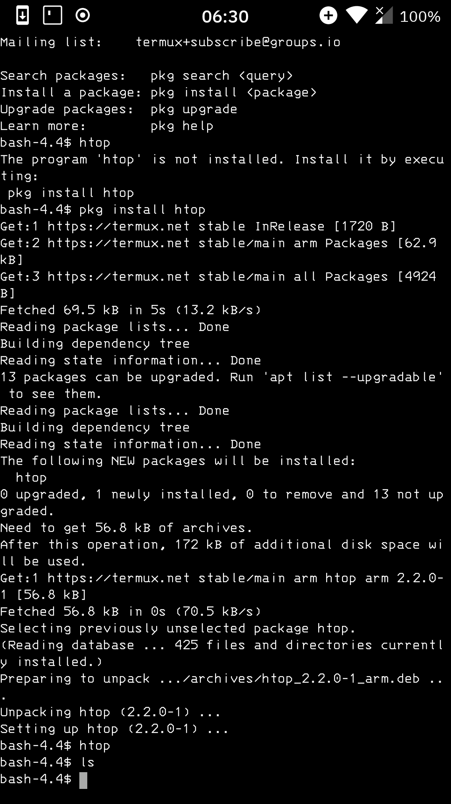

# IBM 3270 monospaced font Magisk Module
## A monospaced font derived from the IBM 3270 series terminal.
This font replaces Droid Sans Mono, so it is only visible in places that use monospaced fonts like terminals, for example.

original font repo:

https://github.com/rbanffy/3270font

## Testing devices:
* OnePlus X with LineageOS 14.1 (Android 7.1.2)

* Samsung Galaxy Tab Pro 8.4 (a.k.a. mondrianwifi/SMT-320) with LineageOS 13.0 (Android 6.0.1)

## Changelog
* 1.0: *initial release*

## Screenshot:

